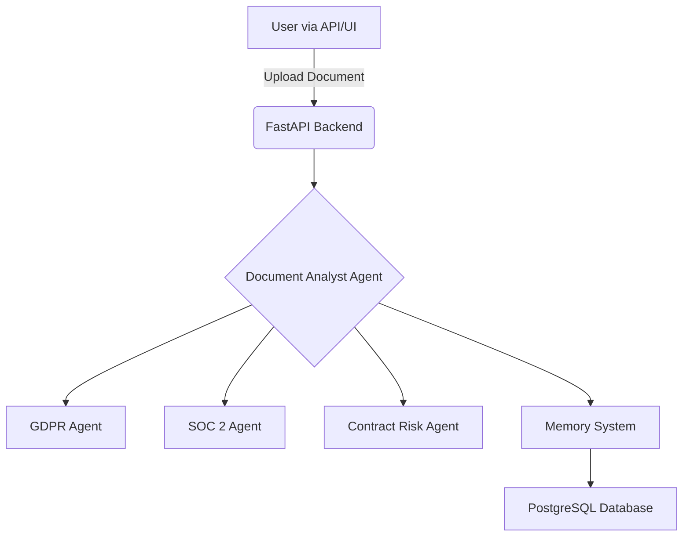

# SIAI Compliance Platform

SIAI (Secure Intelligence & Audit Interface) is a self-hosted platform for analyzing documents for compliance and legal risks. It uses a multi-agent system to review text against established frameworks such as GDPR and SOC 2, identify potential issues, and provide actionable recommendations. The system is designed to be privacy-first, ensuring that all documents and analysis remain within the user's infrastructure.

---

## Table of Contents

- [Core Features](#core-features)
- [System Architecture](#system-architecture)
- [Technology Stack](#technology-stack)
- [Local Development Setup](#local-development-setup)
- [API Usage](#api-usage)
- [Agent Learning Mechanism](#agent-learning-mechanism)
- [Configuration](#configuration)
- [Deployment](#deployment)
- [Contributing](#contributing)
- [License](#license)

---

## Core Features

- **Multi-Framework Analysis**: Analyzes documents against multiple compliance and risk frameworks, including GDPR, SOC 2, and general contract risks. The system is extensible to support other frameworks like HIPAA or ISO 27001.
- **Risk Identification and Scoring**: Identifies compliance gaps, legal risks, and financial exposures. Each finding is assigned a severity level (Critical, High, Medium, Low) and contributes to an overall document risk score.
- **Actionable Recommendations**: Provides specific, actionable recommendations for each finding to guide remediation efforts.
- **Memory-Powered Learning**: Employs a dual-memory system to learn from user feedback, improving accuracy and reducing false positives over time.
- **Privacy-First Architecture**: All components, including the database and agents, are designed to be self-hosted, ensuring that sensitive documents are never transmitted to third-party services.
- **Model Agnosticism**: Compatible with any OpenAI-compatible LLM API, allowing users to choose between high-performance cloud models or private, self-hosted models.

---

## System Architecture

The platform consists of a FastAPI backend and a PostgreSQL database. The backend houses the core agentic system responsible for document analysis.



1.  **FastAPI Backend**: Provides a REST API for document upload, analysis, and retrieval of findings.
2.  **Document Analyst Agent**: The primary agent that orchestrates the analysis workflow using a `perceive -> plan -> act -> reflect` loop.
3.  **Specialized Agents**: Each agent (`GDPRComplianceAgent`, `SOC2ComplianceAgent`, etc.) is an expert in a specific compliance framework.
4.  **Memory System**: Manages the storage and retrieval of compliance findings (episodic memory) and learned risk patterns (semantic memory).
5.  **PostgreSQL Database**: Stores documents, analysis results, and the agent's memory.

---

## Technology Stack

| Component | Technology |
| :--- | :--- |
| **Backend** | FastAPI, Python 3.11 |
| **Database** | PostgreSQL 16, pgvector |
| **Agents** | Custom Python classes |
| **Deployment** | Docker, Docker Compose |
| **Document Parsing**| `python-multipart` (Text), `PyPDF2`/`python-docx` (Binary) |

---

## Local Development Setup

### Prerequisites

- Docker and Docker Compose
- An API key for an OpenAI-compatible LLM provider

### 1. Configuration

Clone the repository and create a `.env` file from the example:

```bash
git clone https://github.com/MouhamedN96/SIAI-Compliance-Platform.git
cd SIAI-Compliance-Platform

cp .env.example .env
```

Open the `.env` file and add your database password and LLM API key:

```env
DB_PASSWORD=your_secure_password
OPENAI_API_KEY=sk-your-openai-key
LLM_MODEL=gpt-4o
```

### 2. Start Services

Run the following command to build and start all services:

```bash
docker-compose up -d
```

This will provision:
- A PostgreSQL database on port `5432`.
- The FastAPI backend on port `8000`.

### 3. Verify Setup

- **API Documentation**: [http://localhost:8000/docs](http://localhost:8000/docs)
- **Health Check**: [http://localhost:8000/health](http://localhost:8000/health)

---

## API Usage

### Upload and Analyze a Document

Send a `POST` request to `/api/documents/upload` with a file to trigger analysis.

**Request:**
```bash
curl -X POST http://localhost:8000/api/documents/upload \
  -F "file=@./privacy_policy.txt" \
  -F "document_type=policy" \
  -F "frameworks=gdpr,soc2"
```

**Response:**
The API returns a JSON object containing the analysis results, including a list of findings, a risk score, and an executive summary.

### Retrieve Findings for a Document

Fetch all findings associated with a specific document ID.

```bash
curl http://localhost:8000/api/documents/{document_id}/findings
```

### Submit Feedback on a Finding

Submit feedback to help the agent learn. This is a critical part of the `reflect` step in the agent loop.

```bash
curl -X POST http://localhost:8000/api/findings/{finding_id}/feedback \
  -H "Content-Type: application/json" \
  -d 
    "finding_id": "finding_123",
    "feedback": "accepted"
  }
```

---

## Agent Learning Mechanism

The agent's learning capability is based on a dual-memory architecture:

1.  **Episodic Memory**: Stores every compliance finding as a discrete event in the `compliance_findings` table. This includes the finding itself, the document context, and any user feedback (`accepted`, `rejected`, `false_positive`).

2.  **Semantic Memory**: Stores generalized risk patterns in the `risk_patterns` table. These patterns are derived by aggregating feedback from episodic memory. For example, if a certain type of clause is repeatedly flagged and accepted by users as a risk, the system learns this as a high-precision pattern.

This feedback loop allows the system to adapt to the specific risk tolerance and document types of an organization, improving its accuracy over time.

---

## Configuration

### LLM Models

The platform is model-agnostic. The LLM can be configured in the `.env` file. For compliance documents, models with large context windows are recommended.

```env
# Anthropic Claude 3.5 Sonnet (recommended for long documents)
# LLM_MODEL=anthropic/claude-3-5-sonnet-20240620

# OpenAI GPT-4o
LLM_MODEL=gpt-4o

# Self-hosted via Ollama
# LLM_MODEL=ollama/llama3
```

### Compliance Frameworks

New frameworks can be added by creating a new agent class in `packages/agents/compliance_agents.py` and registering it in the `DocumentAnalystAgent`.

---

## Deployment

For a production environment, it is recommended to:

1.  Use a managed database service (e.g., AWS RDS, Google Cloud SQL).
2.  Deploy the backend service as a container (e.g., on AWS ECS, Google Cloud Run, or Kubernetes).
3.  Implement a robust authentication layer.
4.  Configure monitoring and logging.

---

## Contributing

Contributions are welcome. Please follow the standard fork-and-pull-request workflow.

1.  Fork the repository.
2.  Create a new branch (`git checkout -b feature/your-feature`).
3.  Commit your changes (`git commit -am 'Add new feature'`).
4.  Push to the branch (`git push origin feature/your-feature`).
5.  Create a new Pull Request.

---

## License

This project is licensed under the MIT License. See the [LICENSE](LICENSE) file for details.
